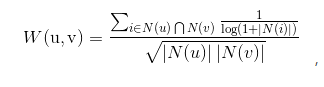
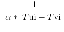
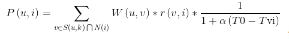

# 时间上下文相关的ItemCF算法实现
UserCF算法认为用户对相同的物品产生过行为，则他们兴趣比较相似，显然如果两个用户同时对同一物品产生行为，则我们认为他们有更大的相似性。例如用户U1在18年1月购买了《推荐系统实战》，用户U2在18年2月购买了《推荐系统实战》，用户U3在15年1月购买了《推荐系统实战》，则我们认为U1和U2的兴趣相似度大于U1和U3。

在计算用户相似度的时候加上时间因素，使用下面公式：

其中Tui表示用户u对物品i产生行为的时间:

可用任意随|Tui-Tvi|递减的且大于0的函数代替

找到和当前用户u兴趣相似的用户后，这组用户最近的兴趣相比之前的兴趣更加接近用户u当前的兴趣，可使用以下公式计算P(u,i)兴趣程度:

,其中T0表示当前时间

