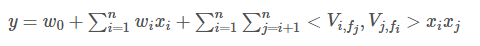

### FFM算法原理

* 设样本一共有nn个特征, ff 个field，那么FFM的二次项有nfnf个隐向量。而在FM模型中，每一维特征的隐向量只有一个。FM可以看作FFM的特例，是把所有特征都归属到一个field时的FFM模型。根据FFM的field敏感特性，可以导出其模型方程。

* 其中，fj是第j的特征所属的字段。如果隐向量的长度为 k，那么FFM的二次参数有 nfk 个，远多于FM模型的 nk 个。此外，由于隐向量与field相关，FFM二次项并不能够化简，时间复杂度是 O(kn2)
